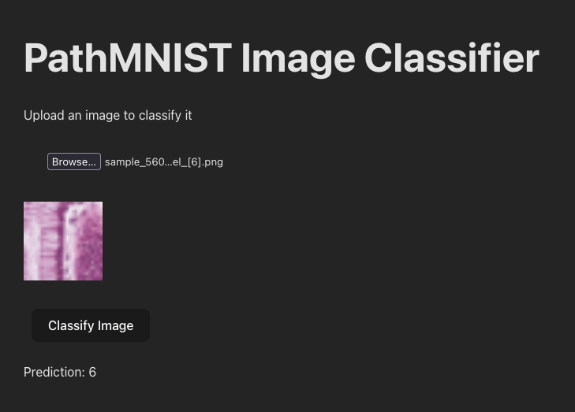

# Pathology CNN

To view another of my projects (ResearchAgent), click here: https://github.com/bluebarryz/ResearchAgent.

## Model
Model trained on the [MedMNIST](https://medmnist.com/) dataset for colon pathology. See [model/pathology_cnn.ipynb](model/pathology_cnn.ipynb) for architecture details.

Utilized Amazon SageMaker for deployment and creating an inference endpoint.

## App

I created an App wrapper so you can submit new images and receive model inferences.

Utilized Flask to setup the backend and Vite + React for the frontend.
